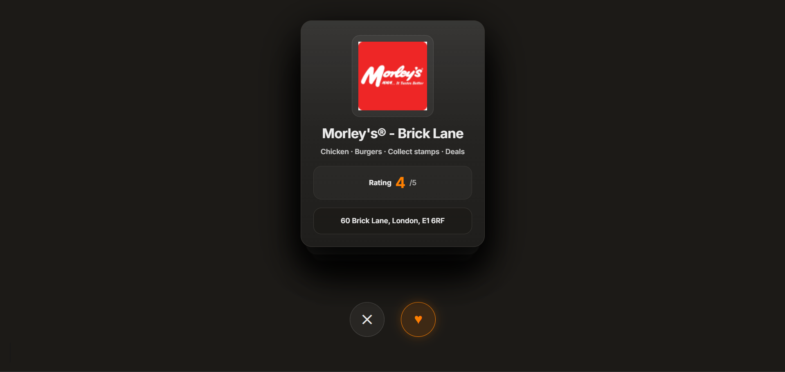

## Getting Started

### 1. Clone repository
```bash
git clone https://github.com/Rahim-Rahmatzada/restaurant-finder.git
cd restaurant-finder
```

## Setup

### Create virtual environment

**Windows**
```bash
python -m venv venv
venv\Scripts\activate
```

**macOS / Linux**
```bash
python3 -m venv venv
source venv/bin/activate
```

### Install dependencies
```bash
pip install -r requirements.txt
```

## Run application
```bash
python main.py
```

You will be prompted:
```
Enter postcode (press Enter to use default CB74DL):
```

## Example
```
Enter postcode (press Enter to use default CB74DL):
Using postcode: CB74DL

Showing 10 restaurants:

Name: Example Restaurant
Cuisines: Pizza, Italian
Rating: 4.5
Address: 123 High Street, London, CB74DL
================================================================================
```

## Assumptions

- Just Eat API endpoint is publicly accessible and does not require authentication
- The API response structure remains consistent
- Address fields (`firstLine`, `city`, `postalCode`) are sufficient for display

## Notes

- The API is protected by Cloudflare, so request headers are required to simulate a browser request
- Postcode validation is not enforced locally due to the complexity of UK postcode formats

## Improvements

If given more time, the following improvements could be made:

- Add postcode validation using a dedicated API instead of dealing with messy regex
- Add sorting (e.g. by rating)
- Add filtering (e.g. by cuisine)
- Implement a web interface (e.g. using Flask or React)
- Add unit tests for core logic
- Add logging instead of print statements
- Implement retry logic for failed API requests


## Tech Stack

- Python 3
- `requests` library

## Project Structure
```
justeat-restaurant-finder/
│
├── main.py
├── requirements.txt
├── README.md
└── .gitignore
```

## Assessment Criteria Coverage

- ✔ Displays required restaurant data (name, cuisines, rating, address)
- ✔ Limits results to first 10 restaurants
- ✔ Clear instructions to build and run
- ✔ Assumptions documented
- ✔ Improvements outlined

## Product Vision - Tinder for Takeaways

Beyond the CLI tool, this project sparked an idea for how restaurant discovery could be reimagined entirely.

Most food delivery apps overwhelm users with long scrollable lists, making it easy to default to the same restaurant every time. A more engaging approach would be a Tinder-style swipe interface built on top of the JET API, presenting one restaurant at a time and letting users swipe to pass or save, until they find somewhere they actually want to order from.

### How it would work

- Enter a UK postcode to load nearby restaurants from the Just Eat API
- Restaurants are presented as individual cards showing name, cuisines, rating, and address
- Swipe right to save a restaurant, swipe left to skip
- A saved list lets users revisit their favourites before deciding where to order

This format reduces decision fatigue, makes discovery feel playful, and surfaces restaurants users might otherwise scroll past.

### Figma Prototype

A UI concept was designed in Figma to explore this idea. The design follows Just Eat's existing brand language - dark backgrounds, orange accents, and bold typography.

**Landing screen** 


**Restaurant card** 



The prototype demonstrates how the existing API response maps directly onto a consumer-facing product with minimal additional infrastructure.

## Use of Generative AI

Generative AI was used selectively and transparently throughout this project.

- **README scaffolding** : AI was used to structure and polish this document. All content, assumptions, and decisions documented here are my own; AI helped with formatting and wording.

- **Docstrings** : AI was used to generate docstrings for functions once the logic was written and finalised, saving time on boilerplate documentation.

- **Research & debugging** : AI was used as a faster alternative to traditional search (e.g. looking up API response structures, Python library behaviour, and HTTP header requirements) 

- **Code logic** : All implementation decisions, architecture, and actual code logic were written by me. AI was not used to generate any functional code.

- **Verification** : Everything AI produced was reviewed and verified by me before being included in the project. No output was accepted uncritically.